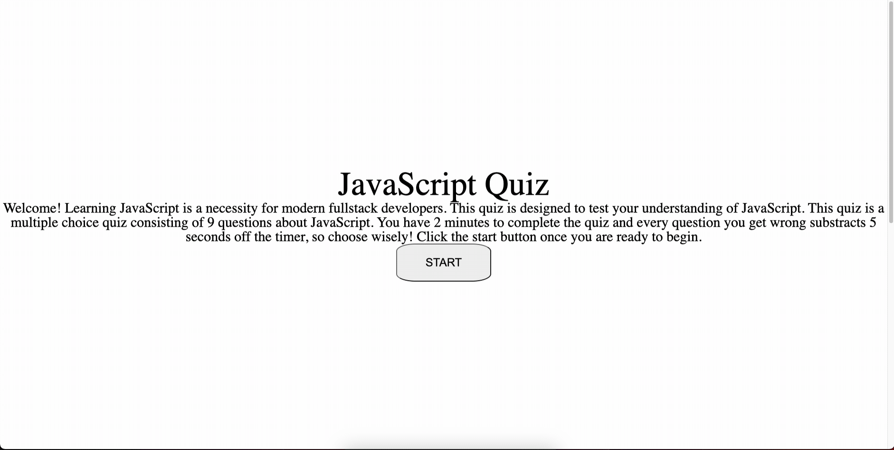

# fundamentals-of-javascript-quiz

This is a multiple choice quiz on the fundamentals of JavaScript

## Visit the Site

[Cleck Here to Visit the Deployed Site](https://ohsweetwampum.github.io/fundamentals-of-javascript-quiz/)

## Description

This is a multiple-choice quiz on the fundamentals of JavaScript. It was made with HTML, CSS, and, of course, lots of JavaScript. Once you click the start button, you are presented with a question and a choice between four different answers, which are buttons that you click on. If you answer incorrectly, then 10 seconds are subtracted from the timer, and you also lose 5 points. You gain 5 points for every correct answer. At the end, you can enter your initials and save your score. If your score is among the top ten highest, then it will show up on the leaderboard. You can press the play again button to do the quiz again.

## Technology Used

- JavaScript
  [Learn about JavaScript](https://developer.mozilla.org/en-US/docs/Web/JavaScript)

- HTML
  [Learn about HTML](https://developer.mozilla.org/en-US/docs/Web/HTML)

- CSS
  [Learn about CSS](https://developer.mozilla.org/en-US/docs/Web/CSS)

- Git
  [Learn about Git](https://git-scm.com/)

## Usage

1. Click start button
2. Answer questions
3. Enter Initials
4. Play again



## Code Highlight

```JavaScript
copy and paste code here

```

## Learning Points

- vf
- vf
- vf
- vf
- vf
- vf
- dv

## Author Info

Matthew Gibson

- [Portfolio](https://github.com/ohSweetWampum)
- [LinkedIn](https://www.linkedin.com/in/matthew-gibson-6b9b12237/)
- [Github](https://github.com/ohSweetWampum)

## Credits

## License

[](https://opensource.org/licenses/MIT)

---

```

```
